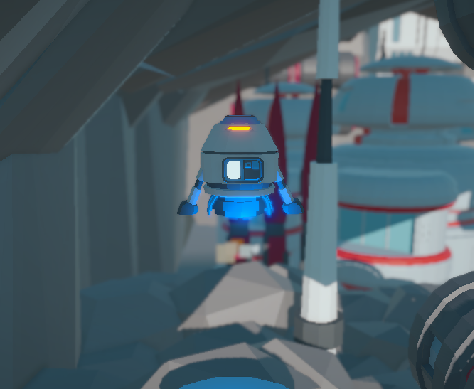
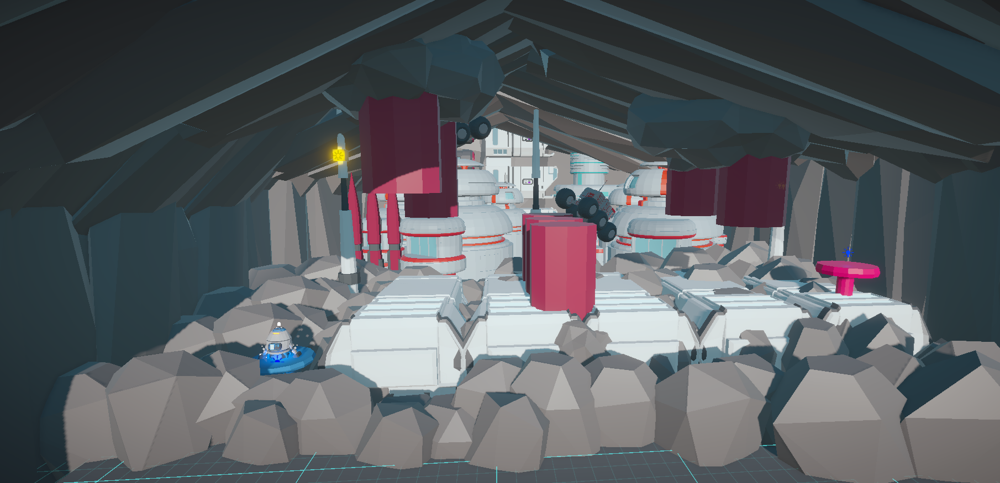
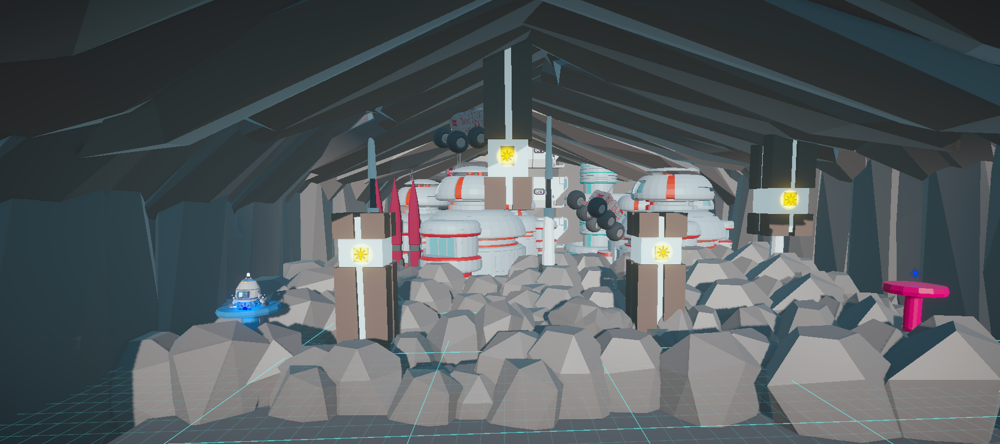
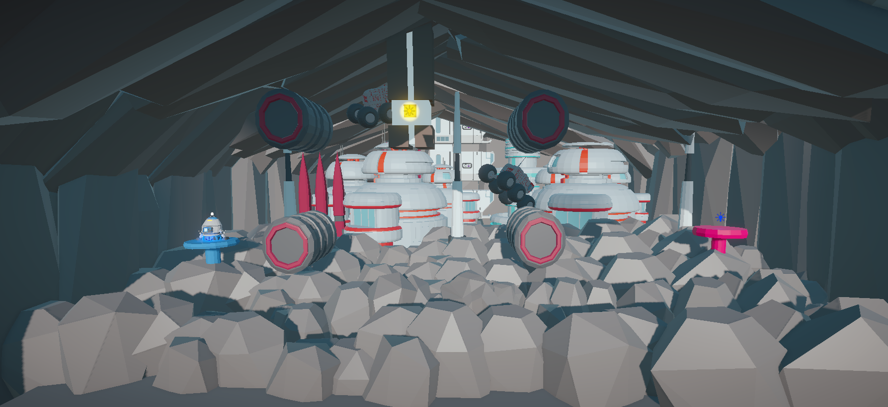

# Rocket Boost

**Rocket Boost** is a game project I developed while learning Unity. This project helped me reinforce fundamental Unity concepts and gain practical game development experience.

## 🔹 About the Project

- Unity basics and scene design
- Prefab usage and object management
- Character movement
- Obstacle system
- Dynamic camera control using Cinemachine
- Particle System for visual effects
- Rigidbody and Collider usage, Trigger functionality
- Lighting and scene atmosphere
- Basic level design

## 🔹 Skills Learned and Systems Used

- **Prefab Workflow:** Reusing objects and dynamically adding them to the scene
- **Movement System:** Controlling character or object movement
- **Obstacle System:** Creating and spawning in-game obstacles
- **Cinemachine Camera:** Camera follow and dynamic angles
- **Particle Effects:** Enhancing visuals with particle systems
- **Physics:** Using Rigidbody, Collider, and Trigger
- **Lighting:** Unity lighting system for scene atmosphere
- **Level Design:** Designing simple scenes and levels

## 🔹 About the Game

In **Rocket Boost**, the player must navigate through obstacles using **Space** and **WASD** keys. The goal is to reach the next area without hitting any obstacles.  

- **Movement:** Use **WASD** to move and **Space** to jump.  
- **Obstacles:** If the player collides with an obstacle, the level restarts.  
- **Particles:**  
  - Jumping triggers a particle effect (`bottom`).  
  - Collision triggers a crash particle effect (`crashParticule`).  
  - Successfully completing a level triggers a success particle effect (`sucessparticle`).  
- **Levels:** The game currently includes **Level 1, Level 2, and Level 3**.  

## 🔹 Screenshots

### Player & Effects
| Description | Screenshot |
|-------------|------------|
| **Bottom** - Player jumps when pressing space; particles appear while jumping |  |
| **Crash Particle** - Particle effect when player hits an obstacle |  |
| **Success Particle** - Particle effect when player successfully completes a level |  |

### Levels
| Level | Screenshot |
|-------|------------|
| **Level 1** |  |
| **Level 2** |  |
| **Level 3** |  |

